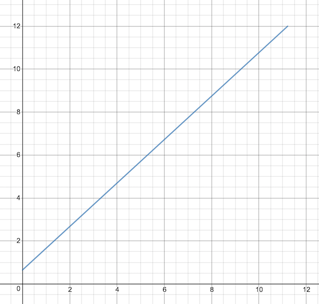

# Motion Profiling with ROOSTER

This is a start-to-finish guide to implementing the robot side of motion profiling using ROOSTER. Generation is a separate matter (and not covered by ROOSTER at the moment)—this covers the steps after you've created motion profile CSV files and deployed them to a folder on the RoboRIO.

## Loading Profiles

Profiles can be pre-loaded from a designated folder on the RoboRIO using a `ProfileContainer`. A `ProfileContainer` automatically loads motion profiles from Pathfinder-style CSV files and keeps them in RAM until they are needed.

For an example, let's say that your folder structure is like so:

```
/home/lvuser/
    profiles/
        foo_left.csv
        foo_right.csv
        bar_left.csv
        bar_right.csv
```

To load these into two motion profiles named "foo" and "bar" (each containing left and right sides), use a `ProfileContainer` as follows:

```java
import edu.wpi.first.wpilibj.IterativeRobot;
import org.team1540.rooster.motionprofiling.ProfileContainer;

public class Robot extends IterativeRobot {
    public static final ProfileContainer profiles;
    
    @Override
    public void robotInit() {
        profiles = new ProfileContainer(new File("/home/lvuser/profiles"));
    }
}
```

You can then access the left and right profiles in a `Command` or anywhere else you might need them:

```java
import edu.wpi.first.wpilibj.command.Command;
import org.team1540.rooster.motionprofiling.ProfileContainer;
import org.team1540.rooster.motionprofiling.MotionProfile;

public class ProfileCommand extends Command {
    @Override
    protected void initialize() {
        ProfileContainer.DriveProfile profiles = Robot.profiles.get("foo");
        MotionProfile left = profiles.getLeft();
        MotionProfile right = profiles.getRight();
        
        // do something with the profiles
    }
    
    // isFinished, etc.
}
```

### Changing the Suffix

Let's say your profiles use a different naming scheme. For instance:

```
/home/lvuser/
    profiles/
        foo.left.csv
        foo.right.csv
        bar.left.csv
        bar.right.csv
```

The `ProfileContainer` supports differing file formats by specifying the suffixes in the constructor:

```java
import edu.wpi.first.wpilibj.IterativeRobot;
import org.team1540.rooster.motionprofiling.ProfileContainer;

public class Robot extends IterativeRobot {
    public static final ProfileContainer profiles;
    
    @Override
    public void robotInit() {
        profiles = new ProfileContainer(new File("/home/lvuser/profiles"), ".left.csv", ".right.csv");
    }
}
```

Once you have your left and right side profiles, you need to do something with them. Execution is a fairly complicated topic involving a number of different steps.

## Empirical Testing

The first step in accurate profile execution is an accurate model of your robot's behavior. While all of these quantities can be calculated theoretically, it is much better to do them empirically.

### Ticks Per Unit and Track Width Testing

Ticks per unit (TPU) is a number representing the correspondence between encoder ticks and real-world position of the wheels on the ground. While TPU can be theoretically calculated by simply dividing the wheel circumference by the number of ticks per rotation of the wheel, it is better measured empirically to account for tread wear and other factors.

Track width (also erroneously called "wheelbase" in certain libraries) is the distance between your robot's left and right wheels, and its theoretical calculation is even simpler—just measure the distance. However, wheelbase is very susceptible to effects from wheel-scrub and other factors (especially if you are using multiple sets of traction wheels). Note that this measurement is often fed into your generation solution, so you may want to go back and remake your paths.

Both track width and TPU can be tested with the `WheelbaseTestRobot`, in the `org.team1540.rooster.util.robots` package. `WheelbaseTestRobot` is a fully self-contained robot class that should be deployed onto your robot. To deploy the `WheelbaseTestRobot` from a project with ROOSTER already added as a dependency, set your robot class to `org.team1540.rooster.util.robots.WheelbaseTestRobot` and deploy.

Once you deploy and connect a driver station, it will throw several values onto SmartDashboard or Shuffleboard. Set your left and right motor IDs and inversions as necessary, then run the Reset and Zero commands. 

#### Ticks Per Unit Testing

To measure TPU, push your robot some defined distance (for example, 10 feet) and note the LPOS and RPOS readouts on the SmartDashboard. (They should be near identical.) Then divide them by the distance your robot traveled to get your ticks per unit. For example, if you push your robot ten feet and measure LPOS and RPOS of about 4500, then your ticks per unit (in this case ticks per foot) would be 450.

#### Track Width Testing

Run the Zero command again, then enter your TPU value from the last step into the "encoderTPU" readout. Additionally, it is reccomended to set the "brake" readout to `true` and run the Reset command. Then, enable the robot (in tele-op mode) and hold down the A button on controller 0 until the robot completes ten full revolutions. Your empirically calculated wheelbase width (in whatever units you used to calculate your TPU) will then be placed in the "Calculated Width" readout.

### Feed-Forward Testing

The next step in your testing is creating an accurate model of your drivetrain performance. A standard (non-shifting) FRC drivetrain's performance can be generally described with three numbers: namely, a velocity constant, a voltage intercept, and an acceleration constant. (For shifting drivetrains, you simply have two sets: one for each gear.) The velocity constant is essentially how many additional volts must be provided to the motor to achieve a speed increase of 1 unit. The acceleration constant is the same, but with acceleration. The voltage intercept is a bit more interesting: it is the y-intercept of a line with velocity on the x-axis and voltage on the y-axis. In other words, it is the voltage needed to overcome static friction effects.



This picture shows the approximate velocity-voltage curve (with voltage on the y-axis) for our 2018 robot. Note how the Y-intercept is nonzero; i.e. a velocity of just above zero requires a good deal of additional voltage to overcome static friction. Testing shows that in FRC drivetrains, this static friction remains regardless of additional velocity, as seen on the graph. 

#### Determining Velocity Curve

Determining your velocity constant and voltage intercept is done in the same test. The theory of the test is essentially collecting data on the motors' velocity as the voltage is slowly increased, and then using linear regression to fit a line of best fit to the data. This process is handled by the `VelocityCharacterizationRobot` in ROOSTER. Deploy the `VelocityCharacterizationRobot` by following the steps described [here](#Ticks Per Unit and Track Width Testing) but using `org.team1540.rooster.util.robots.VelocityCharacterizationRobot`. Configure your inversions, motor IDs, and TPU as described above, then run the Reset command. Place the robot so that it has as long a distance as possible to drive straight, enable the robot, and hold down the A button until your robot reaches an obstacle. Your left and right kV (velocity constant) and vIntercept (voltage intercept) should be placed on the SmartDashboard. Note that these constants will use volts as their unit, and it is likely that you will want the feed-forwards to be in percent throttle—in that case, simply divide them by 12. 

#### Determining Acceleration Constant

In general, it is theoretically possible to determine the acceleration constant empirically. However, if you find yourself unable to do so, you can divide 12 by your robot's theoretical maximum acceleration. The maximum acceleration is equal to your number of motors, multiplied by each motor's stall torque, multiplied by your gear ratio, divided by your wheel radius, divided by the mass of your robot. (Make sure your units line up when making this calculation: maximum torque is often given in newton-meters for FRC motors.) 

Documentation on how to determine acceleration coefficient empirically coming once we figure out how to do it properly.

## Running the Profile

Motion profile execution is tightly integrated into the drive pipeline system. As such, creating a motion profile execution system is as simple as constructing a drive pipeline with a number of stages, and wrapping it in a `SimpleAsyncCommand`:

```java
Executable pipeline = new ProfileInput(leftProfile, rightProfile)
            .andThen(new FeedForwardProcessor(velocityConstant, velocityIntercept, accelerationConstant))
            .andThen(new HeadingPIDProcessor(hdgP, hdgI, hdgD, Gyro::getHeadingInRadians, true))
            .andThen(new UnitScaler(tpu, 0.1))
            .andThen(CTREOutput(leftMotor1, rightMotor1));

Command command = new SimpleAsyncCommand("Run profile", 20, pipeline);
command.start();
```

Breaking the pipeline segments down in detail: 

- The `ProfileInput` takes left and right profiles and runs through them according to a timer. 
- The `FeedForwardProcessor` processes velocity, acceleration, and voltage constants and adds them to the additional feed-forward.
- The `HeadingPIDProcessor` adds a heading-based PID loop to keep the robot driving at the correct heading, and adds the output to the position setpoint on each side. Note that it takes a lambda or method reference in addition to coefficients. This is used for getting the heading in radians from the gyro. (Note that the range should be from -&pi; to &pi; as described in its documentation.)
- The `UnitScaler` re-scales units from whatever your profile units happen to be in to the raw encoder ticks accepted by the motors.
- The `CTREOutput` takes the fully processed command and sends it to the left and right motors.

Since drive pipelines are `Executable`, they can be passed to a `SimpleCommand`. `SimpleAsyncCommand` is  a variant of `SimpleCommand` which executes the code in a different thread at a fixed interval—in this case, 20 milliseconds. 

The `HeadingPIDProcessor` should be tuned in the manner of a normal PID loop; additionally, you should tune the Talon SRX closed-loop position PID. (More on how to do this coming soon.)